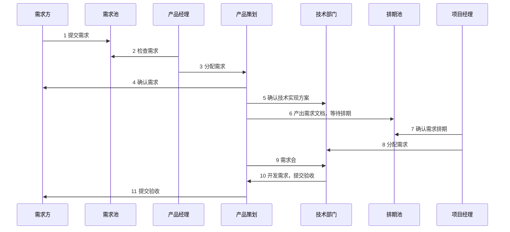

```mermaid
sequenceDiagram
participant 需求方
participant 需求池
participant 产品经理
participant 产品策划
participant 技术部门
participant 排期池
participant 项目经理

需求方->>需求池:1 提交需求
产品经理->>需求池:2 检查需求
产品经理->>产品策划:3 分配需求
产品策划->>需求方:4 确认需求
产品策划->>技术部门:5 确认技术实现方案
产品策划->>排期池:6 产出需求文档，等待排期
项目经理->>排期池:7 确认需求排期
项目经理->>技术部门:8 分配需求
产品策划->>技术部门:9 需求会
技术部门->>产品策划:10 开发需求，提交验收
产品策划->>需求方:11 提交验收

```